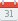

<p align="center">
	
</p>

<h3 align="center">Unified calendar app for The Lesli Framework.</h3>

<hr/>

Version 0.1.0


#### Quick start

```shell
# Add LesliDriver engine
bundle add lesli_driver
```

```shell
# Setup database
rake lesli:db:setup
```

```ruby
# Load LesliDriver
Rails.application.routes.draw do
    mount LesliDriver::Engine => "/driver"
end
```


#### Documentation
* [Roadmap](./docs/roadmap.md)
* [database](./docs/database.md)
* [documentation](https://www.lesli.dev/documentation/)


#### Get in touch

* [Website: https://www.lesli.tech](https://www.lesli.tech)
* [Email: hello@lesli.tech](hello@lesli.tech)
* [Twitter: @LesliTech](hello@lesli.tech)


#### License
-------
Copyright (c) 2023, Lesli Technologies, S. A.

This program is free software: you can redistribute it and/or modify
it under the terms of the GNU General Public License as published by
the Free Software Foundation, either version 3 of the License, or
(at your option) any later version.

This program is distributed in the hope that it will be useful,
but WITHOUT ANY WARRANTY; without even the implied warranty of
MERCHANTABILITY or FITNESS FOR A PARTICULAR PURPOSE. See the
GNU General Public License for more details.

You should have received a copy of the GNU General Public License
along with this program. If not, see http://www.gnu.org/licenses/.

<hr />
<br />

<p align="center">
    
    <h4>Ruby on Rails SaaS Development Framework.</h4>
</p>

